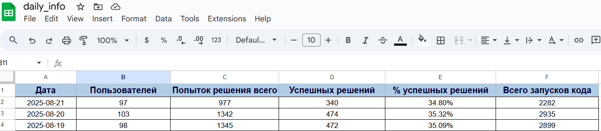
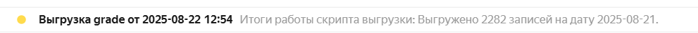

# **Описание проблемы / Задание**
У нас есть корпоративный клиент - крупный онлайн-университет, которому мы интегрировали наш редактор кода внутрь его обучающей системы (ЛМС).
Каждый день тысячи студентов этого университета решают разнообразные задачи в нашем редакторе. И когда они отправляют свои решения, запросы улетают к нам на сервер. Мы обрабатываем эти данные и возвращаем ответы, которые не только позволяют выставить оценку студентам, но и содержат важную информацию об их успехах и прогрессе.
Мы записываем, кто из студентов решал конкретные задачи, какой код они писали, когда была произведена попытка решения, и была ли она успешной. Эти данные помогают университету оценить образовательный процесс, дать обратную связь студентам и определить наиболее эффективные методы обучения.
Стоит задача - забирать от нас данные, собирать их в собственную базу и далее их обрабатывать.
Мы со своей стороны сделали API, в котором доступен один endpoint (URL-адрес), на который можно отправить запрос, указать различные параметры и получить данные из нашей базы.
Нужен свой скрипт для обращения к этому API и получения необходимой информации.

#### Задача написать скрипт, в котором:

* Будет происходить обращение к нашему API для получения данных
* Данные будут обрабатываться и готовиться к загрузке в базу данных
* Обработанные данные будут загружаться в локальную базу PostgreSQL, которую вы развернули на своем компьютере или в облаке
* Во время обработки будет сохраняться лог работы скрипта с отлавливанием всех ошибок и выводом промежуточных стадий (например, скачивание началось / скачивание завершилось / заполнение базы началось и т.д., с трекингом времени). Лог нужно сохранять в текстовый файл. Файл нужно именовать в соответствии с текущей датой. Если в папке с логами уже есть другие логи - их необходимо удалять, оставляем только логи за последние 3 дня.

##### Структура таблицы:

- `user_id` - строковый айди пользователя
- `oauth_consumer_key` - уникальный токен клиента
- `lis_result_sourcedid` - ссылка на блок, в котором находится задача в ЛМС
- `lis_outcome_service_url` - URL адрес в ЛМС, куда мы шлем оценку
- `is_correct` - была ли попытка верной (null, если это run)
- `attempt_type` - ран или сабмит
- `created_at` - дата и время попытки

необходимые нам `oauth_consumer_key`, `lis_result_sourcedid` и `lis_outcome_service_url` спрятаны в `passback_params`
Если что-то не так - запись можно пропустить и занести информацию в лог.

Следующим шагом будет загрузка предобработанных данных в вашу локальную базу PostgreSQL.

##### Логирование
Для всего этого процесса надо организовать лог. Это поможет отлавливать ошибки, информировать о промежуточных стадиях и тд.
Когда начинается скачивание данных, должна произвестись соответствующая INFO запись, когда скачивание завершается - тоже, ошибка доступа к API - запись ERROR со status_code, начали заполнять базу - запись. И все это обязательно с временной меткой.
Сохранить все это надо в текстовый файл, и назвать его в соответствии с текущей датой. Причем, если в папке с логами уже есть другие логи - их необходимо удалить, оставив только логи за последние 3 дня.

##### Агрегирование данных за день
Добавьте в ваш скрипт код, который в конце будет агрегировать данные за день. Например:
* сколько попыток было совершено;
* сколько успешных попыток было из всех совершенных;
* количество уникальных юзеров;
* ...

И загрузите это все в табличку в `Google Sheets`

##### Настройка оповещения на почту
По результатам завершения работы скрипта должно приходить уведомление по электронной почте.


# **Реализация**

### 1. Создание БД
```sql
-- создание БД
CREATE DATABASE grade
    WITH
    OWNER = postgres
    ENCODING = 'UTF8'
    LC_COLLATE = 'ru-RU'
    LC_CTYPE = 'ru-RU'
    LOCALE_PROVIDER = 'libc'
    TABLESPACE = pg_default
    CONNECTION LIMIT = -1
    IS_TEMPLATE = False;

-- создание схемы и привязка user
CREATE SCHEMA IF NOT EXISTS grade AUTHORIZATION tst_user1;
GRANT ALL ON DATABASE grade TO tst_user1;

-- создание таблицы
create table if not exists grade.lms_grage_statistics(
    user_id varchar not null, 
    oauth_consumer_key varchar not null, 
    lis_result_sourcedid varchar, 
    lis_outcome_service_url varchar, 
    is_correct int,
    attempt_type varchar not null,
    created_at timestamp not null,
    PRIMARY KEY (user_id, created_at)
)

ALTER TABLE IF EXISTS grade.lms_grage_statistics
    OWNER to tst_user1;
```

### 2. Описание скрипта
* Для хранения параметров подключения к API, БД, google sheetd, отправки email служит файл `config.ini`. Используется библиотека `configparser`. Реализована функия `load_config` для чтения данных конфигурации.
Файл хранится в той же папки что и скрипт.
Структура файла конфигурации:
```conf
[General]
log_level = logging.INFO

[Database]
host = localhost
port = 5432
database = grade
user = xxxxxx
password = xxxxxx
autocommit = False

[API]
api_url = https://b2b.itresume.ru/api/statistics

[API parameters]
client = Skillfactory
client_key = M2MGWS

[SMTP]
smtp_server = smtp.mail.ru
smtp_port = 465
sender = xxxxxx@mail.ru
password = xxxxxxxxxxxx
recipient = xxxxxxxx@yandex.ru

[google sheets api]
credentials = my_prj_creds.json
file = daily_info

```
* Для работы с параметрами командной строки применяется библиотека `argparse`, для чтения аргументоа реализована функция `parse_args`
* Для работы с БД postgresql используется библиотека `psycopg2`. Создан класс `DataBase`, реализованы методы: `get_instance`, `select`, `insert`, `close_connection`
* Для загрузки данных из API обучающей системы реализована функция `get_user_activity`
* Логирование реализовано с использованием библиотеки `logging`. Реализованы функции для настройки и сброса логирования:  `start_logging`, `drop_logging`

*Пример содержимого log файла*:
```plaintext
2025-08-22 12:53:15,595: root - INFO: Начало работы скрипта ...
2025-08-22 12:53:15,598: root - INFO: Лог файл log20250818.log : дата создания - 2025-08-18 удален
2025-08-22 12:53:15,598: root - INFO: Подключение к API
2025-08-22 12:53:48,932: root - INFO: Завершение работы с API
2025-08-22 12:53:49,056: root - INFO: Соединение c БД установлено
2025-08-22 12:53:49,146: root - INFO: Очистка данных в БД, удалено записей 0
2025-08-22 12:53:49,250: root - INFO: Массовая загрузка данных в БД завершена
2025-08-22 12:53:49,250: root - INFO: Подготовка итогов дня к выгрузке
2025-08-22 12:53:49,279: root - INFO: Итоги дня подготовлены
2025-08-22 12:53:49,297: root - INFO: Соединение с БД закрыто
2025-08-22 12:53:49,299: root - INFO: Подключение к google sheets
2025-08-22 12:54:00,415: root - INFO: Итоги записаны в таблицу google sheets
2025-08-22 12:54:01,438: root - INFO: Email отправлен
2025-08-22 12:54:01,658: root - INFO: Процесс выгрузки завершен
```

* Для подключения к google sheets используется библиотека `gspread`. Подключение происходит через сервисный аккаунт. Реализована функция `get_spreadsheet`.

*Пример регистрации итогов в google sheets*:



* Для отправки email используются библиотеки `smtplib` и `email`. Реализована функция `send_email`.

*Пример информацмонного письма*:


